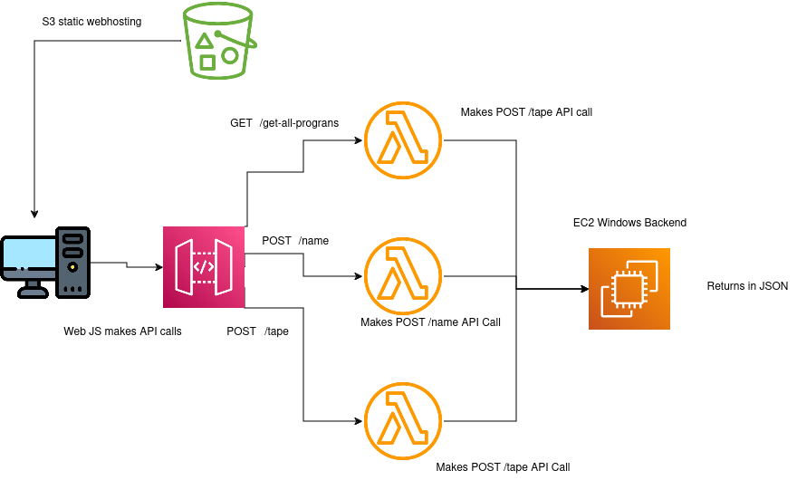

# Despliegue del Sistema Legado Encapsulado en AWS

Este proyecto guía el despliegue de un sistema legado encapsulado en AWS utilizando API Gateway, Lambda y EC2 sobre HTTP. El sistema se basa en MS-DOS y utiliza DosBox para su emulación. La arquitectura incluye S3 para el alojamiento estático del frontend, una instancia EC2 como backend, y una API REST que utiliza funciones Lambda para comunicar el frontend con el backend.

---

## Tabla de Contenidos

1. [Contexto del Problema](#contexto-del-problema)
2. [Recordatorio](#recordatorio)
3. [Configuración Inicial](#configuración-inicial)
4. [Stage 1: Configuración de EC2 Backend Windows](#stage-1-configuración-de-ec2-backend-windows)
   - [1.1 Conexión, Configuración y Despliegue en EC2](#11-conexión-configuración-y-despliegue-en-ec2)
5. [Stage 2: Configuración y Creación de Lambda](#stage-2-configuración-y-creación-de-lambda)
   - [2.1 Configuración de Lambda Layer](#21-configuración-de-lambda-layer)
   - [2.2 Creación de Lambda Role y Lambdas](#22-creación-de-lambda-role-y-lambdas)
6. [Stage 3: Creación de la API REST](#stage-3-creación-de-la-api-rest)
   - [3.1 Creación de Recursos para la API](#31-creación-de-recursos-para-la-api)
   - [3.2 Deploy de la API](#32-deploy-de-la-api)
7. [Stage 4: Creación y Configuración del Bucket S3 para Hospedaje Web](#stage-4-creación-y-configuración-del-bucket-s3-para-hospedaje-web)
   - [4.1 Definir Bucket Policy](#41-definir-bucket-policy)
   - [4.2 Habilitar Static Hosting](#42-habilitar-static-hosting)
8. [Stage 5: Pruebas](#stage-5-pruebas)
9. [Stage 6: Limpieza](#stage-6-limpieza)

---

## Contexto del Problema

Se ha implementado una aplicación web que encapsula un sistema legado operando en MS-DOS, utilizando DosBox para emulación. Para modernizar la solución, emplearemos productos de AWS: S3 para el hosting estático, una instancia EC2 con Windows como backend, y una API REST mediante funciones Lambda que faciliten la comunicación entre el frontend y backend. La aplicación MS-DOS necesita una GUI para capturar pantalla, lo que hace necesario el uso de EC2; de otro modo, podría haberse refactorizado para EKS o Beanstalk, o ejecutarse on-premises conectada a este entorno.

## Recordatorio

Este despliegue se realizará sobre la VPC predeterminada de la cuenta, lo cual **no es recomendable** para entornos de producción. Este repositorio tiene fines didácticos, por lo que se desaconseja su uso en entornos reales.

> **Imagen de arquitectura sugerida:** 

---

## Configuración Inicial

1. Inicia sesión en tu cuenta de AWS con el usuario `iadmin`.
2. Selecciona la región **eu-east-1**.

## Stage 1: Configuración de EC2 Backend Windows

1. Accede a la consola de EC2, selecciona “Lanzar instancia” y elige la AMI de Windows.
2. Selecciona el tipo de instancia `t3.small`, dado que tipos de instancia menores exceden el límite de tiempo de solicitud máximo de 29 segundos.
3. Nombra la instancia como `DosBoxBackend` y selecciona un par de claves (o crea uno nuevo si no tienes).
4. Selecciona la VPC por defecto, permite que cree un grupo de seguridad, y lanza la instancia.
5. Una vez que la instancia esté en estado `Running` con `Check Status 2/2 Check Initialized Success`, anota el ID del grupo de seguridad para modificarlo más tarde.

### 1.1 Conexión, Configuración y Despliegue en EC2

1. Accede a la instancia descargando el archivo `.rdp`, descifra la contraseña usando tu archivo `.pem` y conecta.
2. Permite las conexiones TCP en el puerto 5000 en el grupo de seguridad y en las reglas del firewall de Windows.
3. Descarga e instala Python en la instancia (asegúrate de habilitar la opción de modificar PATH).
4. Extrae el contenido del repositorio y ejecuta los comandos necesarios para instalar dependencias y desplegar la aplicación.
5. Ejecuta `app.py` para tener el backend operativo y anota la IP pública de la instancia para configurarla en el siguiente paso.

---

## Stage 2: Configuración y Creación de Lambda

### 2.1 Configuración de Lambda Layer

1. En la carpeta `lambda`, encontrarás el archivo `layer_content.zip` con las dependencias empaquetadas.
2. Crea una nueva capa en AWS Lambda y sube el archivo `.zip`. Nombra la capa `requestLayer`.

### 2.2 Creación de Lambda Role y Lambdas

1. Dirígete a CloudFormation, selecciona “Crear pila” y carga `lambda/lambda.yaml`.
2. Cambia la IP en el parámetro por la IP pública de tu instancia EC2 y crea la pila.
3. Una vez creada, verifica que las funciones Lambda y el rol de ejecución se hayan generado correctamente.

---

## Stage 3: Creación de la API REST

### 3.1 Creación de Recursos para la API

1. Crea una nueva API REST y nómbrala `retromania-api`.
2. Para cada recurso (`/tape`, `/name`, `/get-all-programs`), habilita CORS, selecciona los métodos correspondientes y asocia las funciones Lambda correspondientes.

### 3.2 Deploy de la API

1. Implementa la API creando una etapa llamada `prod`.
2. Copia la URL generada para configurarla en el archivo de tu frontend.

---

## Stage 4: Creación y Configuración del Bucket S3 para Hospedaje Web

### 4.1 Definir Bucket Policy

1. Crea un bucket S3, nómbralo `retromania-base-unizar-<números-aleatorios>` y deshabilita los bloqueos de acceso público.
2. Configura los permisos del bucket, copiando el contenido de `s3/bucket_policy.json` y reemplazando el ARN con el del bucket.

### 4.2 Habilitar Static Hosting

1. Modifica el archivo `s3/script.js`, actualizando `BASE_API_URL` con la URL de la API REST.
2. Habilita la opción de `Static Website Hosting` en S3 y sube los archivos `index.html`, `styles.css` y `script.js`.

---

## Stage 5: Pruebas

1. Accede a la URL del bucket S3. Tras 20 segundos, los registros deberían estar completados y deberían poder realizarse búsquedas.

---

## Stage 6: Limpieza

1. Elimina todos los recursos creados: vacía y elimina el bucket S3, elimina la API REST, la capa Lambda, la instancia EC2, y borra la pila en CloudFormation.
2. Finaliza la instancia EC2 para volver la cuenta a su estado anterior.

---

¡Y listo! Con estos pasos, el sistema legado debe estar correctamente encapsulado y desplegado en AWS.
